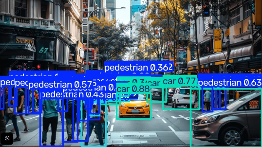

# visdrone-cicd
# VisDrone CI/CD

YOLO object detection project with automated testing using GitHub Actions.

## CI Pipeline

The pipeline automatically:
- installs dependencies
- runs flake8
- runs pytest
- performs YOLO inference on a test image
- uploads the prediction result as a GitHub Actions artifact

## Sample Inference Result

